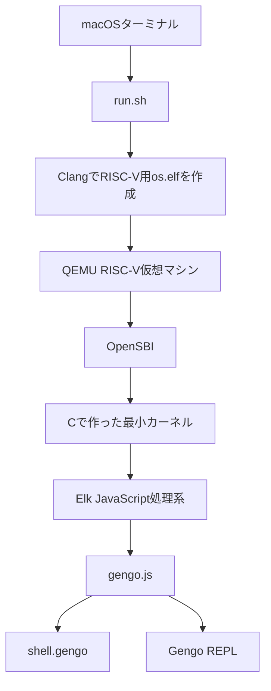
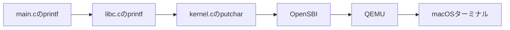
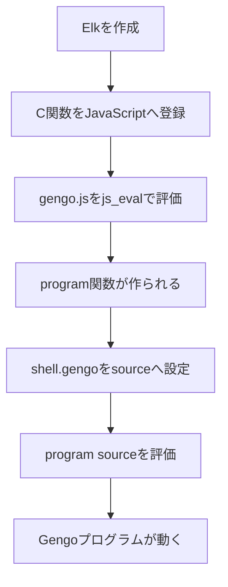

# 91os

この演習は、RISC-Vの独自OSの上で小型JavaScript処理系を動かし、そのJavaScript上で独自言語Gengoを実行する学習用プロジェクトです。

最初はC言語の `printf` だけが動く小さなカーネルを作ります。その後、ElkというJavaScript処理系、自作したGengo処理系、起動スクリプト、REPLの機能を段階的に追加します。

完成版のソースコードはこちらで公開しています。

[https://github.com/takesako/91os](https://github.com/takesako/91os)

## このプロジェクトで作るもの

最終的な実行環境は、次の通りです。



CPUが直接実行するのは、C言語から生成したRISC-Vの機械語です。

その上でElkがJavaScriptを解釈し、Elk上で動く `gengo.js` がGengoのソースコードを解釈します。

```text
RISC-V機械語
  Cで作った最小カーネル
    Elk
      gengo.js
        shell.gengo
        REPLへ入力したGengoコード
```

## 到達目標

このプロジェクトを通して、次の内容を理解します。

- RISC-V向けの最小カーネルをビルドする方法
- リンカスクリプトと起動処理の役割
- OSのない環境で必要になる小さなCライブラリ
- QEMU、OpenSBI、カーネルの関係
- C関数をJavaScriptへ公開する方法
- JavaScriptで独自言語処理系を作る方法
- ソースコードをC配列へ変換してカーネルへ埋め込む方法
- REPLのRead、Eval、Print、Loopの流れ
- Gitによる段階的な開発とGitHubへのpush

## 動作環境

このREADMEは、次の環境を想定しています。

- macOS
- Homebrew
- VS Code
- Git
- LLVM
- QEMU
- `xxd`

必要なコマンドを確認します。

```bash
brew --version
git --version
code --version
command -v xxd
```

LLVMとQEMUが未導入の場合は、次を実行します。

```bash
brew install llvm qemu
```

`xxd` が見つからない場合は、Vimを導入します。

```bash
brew install vim
command -v xxd
```

## 作業フォルダを作る

作業フォルダを作成して、OSの起動や言語処理系の仕組みを理解しながら作ります。

```bash
cd ~
mkdir 91os
cd 91os
code .
```

現在のフォルダ位置をファイル一覧を確認します。

```bash
pwd
ls -la
```

Gitリポジトリを開始します。

```bash
git init
git branch -M main
```

生成物をGitへ登録しないため、`.gitignore` を作ります。

```bash
code .gitignore
```

次を保存します。

```text
os.elf
os.map
gengo.h
shell.h
.DS_Store
```

最初のコミットを作ります。

```bash
git add .gitignore
git commit -m "init"
```

## 演習1 `printf` だけが動く最小OS

最初は次のファイルだけを作ります。

```text
91os-step/
├── .gitignore
├── boot.ld
├── kernel.c
├── stdio.h
├── libc.h
├── libc.c
├── main.c
└── run.sh
```

Elk、正規表現、Gengoはまだ追加しません。

### `boot.ld`

完成版のリンカスクリプトを参照します。

[boot.ld](https://github.com/takesako/91os/blob/main/boot.ld)

```bash
code boot.ld
```

`boot.ld` は、コード、読み取り専用データ、データ、BSS、スタックをメモリのどこへ配置するか指定します。

### `kernel.c`

完成版のカーネルを参照します。

[kernel.c](https://github.com/takesako/91os/blob/main/kernel.c)

```bash
code kernel.c
```

`kernel.c` の主な役割は次のとおりです。

- スタックポインタの設定
- BSS領域の初期化
- `main` 関数の呼び出し
- OpenSBIを利用した文字入出力
- 待機処理
- QEMUの終了

### `stdio.h`

完成版のヘッダを参照します。

[stdio.h](https://github.com/takesako/91os/blob/main/stdio.h)

```bash
code stdio.h
```

### 最小の `libc.h`

```bash
code libc.h
```

次を保存します。

```c
#ifndef LIBC_H
#define LIBC_H

typedef __SIZE_TYPE__ size_t;
int printf(const char *format, ...);

#endif
```

この段階では、`size_t` と `printf` だけを用意します。

### 最小の `libc.c`

```bash
code libc.c
```

次を保存します。

```c
#include "libc.h"

int printf(const char *format, ...) {
    int count = 0;

    while (*format != '\0') {
        putchar(*format);
        format++;
        count++;
    }

    return count;
}
```

この `printf` は、書式指定を処理しません。

受け取った文字列を1文字ずつ `putchar` へ渡すだけです。

### 最初の `main.c`

```bash
code main.c
```

次を保存します。

```c
#include "libc.h"

void main(void) {
    printf("Hello my OS!\n");
}
```

### 最初の `run.sh`

```bash
code run.sh
```

次を保存します。

```bash
#!/bin/bash
set -xue

QEMU=qemu-system-riscv64
CC="$(brew --prefix llvm)/bin/clang"

CFLAGS='-std=c11 -O2 -g3 -Wall -Wextra --target=riscv64-unknown-elf -march=rv64imafd -mabi=lp64d -mcmodel=medany -fuse-ld=lld -fno-stack-protector -ffreestanding -nostdlib'

$CC $CFLAGS -Wl,-Tboot.ld -Wl,-Map=os.map -o os.elf kernel.c libc.c main.c

$QEMU -machine virt -bios default -nographic -serial mon:stdio --no-reboot -kernel os.elf
```

実行権限を付けます。

```bash
chmod +x run.sh
```

実行します。

```bash
./run.sh
```

次が表示されれば成功です。

```text
Hello my OS!
```

### 文字が表示されるまで



### わざと失敗する

`main.c` を次のように変更します。

```c
#include "libc.h"

void main(void) {
    printf("1 + 2 = %d\n", 3);
}
```

再実行します。

```bash
./run.sh
```

最小版の `printf` では、次のように表示されます。

```text
1 + 2 = %d
```

数値の `3` は表示されません。

最小版の `printf` は `%d` を解析せず、文字列をそのまま表示しているためです。

確認後、`main.c` を元へ戻します。

### Gitへ保存する

```bash
git add .
git commit -m "step1: print my os"
```

## 演習2 Cライブラリを完成版へ置き換える

Elkを動かすには、メモリ操作、文字列操作、数値変換、ヒープ管理、書式付き出力が必要です。

`libc.h` ファイルを作成します。

```bash
open libc.h
```

必要な関数だけ宣言します。以下の内容を書いてください。

```c
// Small libc-independent support layer for Elk.
#ifndef LIBC_H
#define LIBC_H

typedef unsigned char      uint8_t;
typedef signed char        int8_t;
typedef unsigned short     uint16_t;
typedef signed short       int16_t;
typedef unsigned int       uint32_t;
typedef signed int         int32_t;
typedef unsigned long long uint64_t;
typedef signed long long   int64_t;

typedef __SIZE_TYPE__      size_t;
typedef __PTRDIFF_TYPE__   ptrdiff_t;
typedef __UINTPTR_TYPE__   uintptr_t;
typedef __INTPTR_TYPE__    intptr_t;

typedef _Bool bool;
#define true  1
#define false 0

#ifndef NULL
#define NULL ((void *) 0)
#endif

void *memcpy(void *dst, const void *src, size_t len);
void *memmove(void *dst, const void *src, size_t len);
void *memset(void *dst, int value, size_t len);
int memcmp(const void *lhs, const void *rhs, size_t len);

size_t strlen(const char *str);
char *strchr(const char *str, int ch);
double strtod(const char *str, char **end);
double modf(double value, double *integer);

// Supported conversions are those used by elk.c:
//   %s, %.*s, %d, %u, %lu, %lx, %g, %.17g and %%
int vsnprintf(char *dst, size_t size, const char *format, __builtin_va_list ap);
int snprintf(char *dst, size_t size, const char *format, ...);
void printf(const char *fmt, ...);

// Fixed-arena allocator. The application owns the supplied memory.
// Calling heap_init again discards all previous allocations.
void heap_init(void *memory, size_t size);
void *malloc(size_t size);
void free(void *ptr);
size_t heap_available(void);

#endif
```

実際の関数を中身を書くため、`libc.c` ファイルを作成します。

```bash
open libc.c
```

以下のコードを書いてください。長いのでコピペでokです。

```c
#include "stdio.h"
#include "libc.h"

#define ELK_ALIGN (sizeof(void *))
#define ELK_ALIGN_UP(n) (((n) + ELK_ALIGN - 1U) / ELK_ALIGN * ELK_ALIGN)

struct heap_block {
  size_t size;
  struct heap_block *next;
  int free;
};

static struct heap_block *s_heap;

void *memcpy(void *dst, const void *src, size_t len) {
  unsigned char *d = (unsigned char *) dst;
  const unsigned char *s = (const unsigned char *) src;
  for (size_t i = 0; i < len; i++) d[i] = s[i];
  return dst;
}

void *memmove(void *dst, const void *src, size_t len) {
  unsigned char *d = (unsigned char *) dst;
  const unsigned char *s = (const unsigned char *) src;
  if (d < s) {
    for (size_t i = 0; i < len; i++) d[i] = s[i];
  } else if (d > s) {
    while (len > 0) {
      len--;
      d[len] = s[len];
    }
  }
  return dst;
}

void *memset(void *dst, int value, size_t len) {
  unsigned char *d = (unsigned char *) dst;
  for (size_t i = 0; i < len; i++) d[i] = (unsigned char) value;
  return dst;
}

int memcmp(const void *lhs, const void *rhs, size_t len) {
  const unsigned char *a = (const unsigned char *) lhs;
  const unsigned char *b = (const unsigned char *) rhs;
  for (size_t i = 0; i < len; i++) {
    if (a[i] != b[i]) return a[i] < b[i] ? -1 : 1;
  }
  return 0;
}

size_t strlen(const char *str) {
  size_t len = 0;
  if (str != NULL) while (str[len] != '\0') len++;
  return len;
}

char *strchr(const char *str, int ch) {
  char wanted = (char) ch;
  if (str == NULL) return NULL;
  for (;;) {
    if (*str == wanted) return (char *) str;
    if (*str++ == '\0') return NULL;
  }
}

static int space(char ch) {
  return ch == ' ' || ch == '\t' || ch == '\n' || ch == '\r' ||
         ch == '\f' || ch == '\v';
}

static int digit(char ch) {
  return ch >= '0' && ch <= '9';
}

static int hex_digit(char ch) {
  if (ch >= '0' && ch <= '9') return ch - '0';
  if (ch >= 'a' && ch <= 'f') return ch - 'a' + 10;
  if (ch >= 'A' && ch <= 'F') return ch - 'A' + 10;
  return -1;
}

static double pow10(int exponent) {
  double result = 1.0, factor = exponent < 0 ? 0.1 : 10.0;
  unsigned int count =
      (unsigned int) (exponent < 0 ? -(exponent + 1) + 1 : exponent);
  while (count > 0) {
    if (count & 1U) result *= factor;
    factor *= factor;
    count >>= 1U;
  }
  return result;
}

double strtod(const char *str, char **end) {
  const char *start = str;
  while (space(*str)) str++;
  int negative = 0;
  if (*str == '+' || *str == '-') negative = *str++ == '-';

  if (str[0] == '0' && (str[1] == 'x' || str[1] == 'X') &&
      hex_digit(str[2]) >= 0) {
    unsigned long long hex = 0;
    str += 2;
    int digit = 0;
    while ((digit = hex_digit(*str)) >= 0) {
      hex = hex * 16ULL + (unsigned int) digit;
      str++;
    }
    if (end != NULL) *end = (char *) str;
    double value = (double) hex;
    return negative ? -value : value;
  }

  double value = 0.0;
  int digits = 0;
  while (digit(*str)) {
    value = value * 10.0 + (double) (*str++ - '0');
    digits++;
  }
  if (*str == '.') {
    double place = 0.1;
    str++;
    while (digit(*str)) {
      value += (double) (*str++ - '0') * place;
      place *= 0.1;
      digits++;
    }
  }

  const char *exponent_start = str;
  int exponent = 0, exponent_negative = 0, exponent_digits = 0;
  if (digits > 0 && (*str == 'e' || *str == 'E')) {
    str++;
    if (*str == '+' || *str == '-') exponent_negative = *str++ == '-';
    while (digit(*str)) {
      if (exponent < 10000) exponent = exponent * 10 + (*str - '0');
      str++;
      exponent_digits++;
    }
    if (exponent_digits == 0) str = exponent_start;
  }

  if (digits == 0) {
    str = start;
    value = 0.0;
  } else if (exponent_digits > 0) {
    value *= pow10(exponent_negative ? -exponent : exponent);
  }
  if (end != NULL) *end = (char *) str;
  return negative ? -value : value;
}

double modf(double value, double *integer) {
  union {
    double d;
    unsigned long long u;
  } x = {value};
  unsigned int exponent = (unsigned int) ((x.u >> 52U) & 0x7ffU);
  unsigned long long sign = x.u & 0x8000000000000000ULL;

  if (exponent == 0x7ffU) {
    *integer = value;
    return exponent && (x.u & 0xfffffffffffffULL) ? value
                                                   : (union { unsigned long long u; double d; }) {sign}.d;
  }

  int shift = (int) exponent - 1023;
  if (shift < 0) {
    *integer = (union { unsigned long long u; double d; }) {sign}.d;
    return value;
  }
  if (shift >= 52) {
    *integer = value;
    return (union { unsigned long long u; double d; }) {sign}.d;
  }

  unsigned long long mask = (1ULL << (52 - shift)) - 1ULL;
  if ((x.u & mask) == 0) {
    *integer = value;
    return (union { unsigned long long u; double d; }) {sign}.d;
  }

  x.u &= ~mask;
  *integer = x.d;
  return value - x.d;
}

struct output {
  char *dst;
  size_t size;
  size_t used;
};

static void out_char(struct output *out, char ch) {
  if (out->size > 0 && out->used + 1U < out->size) out->dst[out->used] = ch;
  out->used++;
}

static void out_data(struct output *out, const char *str, size_t len) {
  for (size_t i = 0; i < len; i++) out_char(out, str[i]);
}

static void out_unsigned(struct output *out,
                             unsigned long long value,
                             unsigned int base) {
  char reversed[sizeof(value) * 8U];
  size_t len = 0;
  do {
    unsigned int digit = (unsigned int) (value % base);
    reversed[len++] = (char) (digit < 10U ? '0' + digit : 'a' + digit - 10U);
    value /= base;
  } while (value != 0);
  while (len > 0) out_char(out, reversed[--len]);
}

static unsigned long long pow10_u(unsigned int exponent) {
  unsigned long long result = 1;
  while (exponent-- > 0) result *= 10ULL;
  return result;
}

static void out_double(struct output *out, double value,
                           unsigned int precision) {
  if (value != value) {
    out_data(out, "nan", 3);
    return;
  }
  if (value > 1.7976931348623157e308) {
    out_data(out, "inf", 3);
    return;
  }
  if (value < -1.7976931348623157e308) {
    out_data(out, "-inf", 4);
    return;
  }
  if (value < 0.0) {
    out_char(out, '-');
    value = -value;
  }
  if (value == 0.0) {
    out_char(out, '0');
    return;
  }
  double integer = 0.0;
  if (modf(value, &integer) == 0.0 &&
      integer <= 9007199254740991.0) {
    out_unsigned(out, (unsigned long long) integer, 10);
    return;
  }
  if (precision == 0) precision = 1;
  if (precision > 17) precision = 17;

  int exponent = 0;
  double normalized = value;
  while (normalized >= 10.0) normalized *= 0.1, exponent++;
  while (normalized < 1.0) normalized *= 10.0, exponent--;

  unsigned long long scale = pow10_u(precision - 1U);
  unsigned long long digits =
      (unsigned long long) (normalized * (double) scale + 0.5);
  if (digits >= scale * 10ULL) digits /= 10ULL, exponent++;

  char text[18];
  for (unsigned int i = 0; i < precision; i++) {
    text[precision - i - 1U] = (char) ('0' + digits % 10ULL);
    digits /= 10ULL;
  }
  size_t significant = precision;
  while (significant > 1 && text[significant - 1] == '0') significant--;

  if (exponent < -4 || exponent >= (int) precision) {
    out_char(out, text[0]);
    if (significant > 1) {
      out_char(out, '.');
      out_data(out, text + 1, significant - 1);
    }
    out_char(out, 'e');
    if (exponent < 0) {
      out_char(out, '-');
      exponent = -exponent;
    } else {
      out_char(out, '+');
    }
    if (exponent < 10) out_char(out, '0');
    out_unsigned(out, (unsigned long long) exponent, 10);
  } else if (exponent >= 0) {
    size_t integer_digits = (size_t) exponent + 1U;
    for (size_t i = 0; i < integer_digits; i++)
      out_char(out, i < significant ? text[i] : '0');
    if (significant > integer_digits) {
      out_char(out, '.');
      out_data(out, text + integer_digits, significant - integer_digits);
    }
  } else {
    out_data(out, "0.", 2);
    for (int i = -1; i > exponent; i--) out_char(out, '0');
    out_data(out, text, significant);
  }
}

int vsnprintf(char *dst, size_t size, const char *format, __builtin_va_list ap) {
  struct output out = {dst, size, 0};
  while (*format != '\0') {
    if (*format != '%') {
      out_char(&out, *format++);
      continue;
    }
    format++;
    if (*format == '%') {
      out_char(&out, *format++);
      continue;
    }

    int precision = -1;
    if (*format == '.') {
      format++;
      if (*format == '*') {
        precision = __builtin_va_arg(ap, int);
        format++;
      } else {
        precision = 0;
        while (digit(*format))
          precision = precision * 10 + (*format++ - '0');
      }
    }
    int is_long = *format == 'l';
    if (is_long) format++;
    char conversion = *format == '\0' ? '\0' : *format++;

    if (conversion == 's') {
      const char *str = __builtin_va_arg(ap, const char *);
      size_t len = strlen(str);
      if (precision >= 0 && (size_t) precision < len) len = (size_t) precision;
      out_data(&out, str == NULL ? "(null)" : str,
                   str == NULL ? 6U : len);
    } else if (conversion == 'd') {
      long value = is_long ? __builtin_va_arg(ap, long) : (long) __builtin_va_arg(ap, int);
      if (value < 0) {
        out_char(&out, '-');
        out_unsigned(&out, 0ULL - (unsigned long long) value, 10);
      } else {
        out_unsigned(&out, (unsigned long long) value, 10);
      }
    } else if (conversion == 'u' || conversion == 'x') {
      unsigned long value =
          is_long ? __builtin_va_arg(ap, unsigned long)
                  : (unsigned long) __builtin_va_arg(ap, unsigned int);
      out_unsigned(&out, (unsigned long long) value,
                       conversion == 'x' ? 16U : 10U);
    } else if (conversion == 'g') {
      out_double(&out, __builtin_va_arg(ap, double),
                     precision < 0 ? 6U : (unsigned int) precision);
    } else {
      out_char(&out, '%');
      if (conversion != '\0') out_char(&out, conversion);
    }
  }
  if (size > 0) dst[out.used < size ? out.used : size - 1U] = '\0';
  return out.used > 2147483647U ? 2147483647 : (int) out.used;
}

int snprintf(char *dst, size_t size, const char *format, ...) {
  __builtin_va_list ap;
  __builtin_va_start(ap, format);
  int result = vsnprintf(dst, size, format, ap);
  __builtin_va_end(ap);
  return result;
}

void heap_init(void *memory, size_t size) {
  size_t header = ELK_ALIGN_UP(sizeof(struct heap_block));
  s_heap = NULL;
  if (memory == NULL || size <= header) return;
  size_t address = (size_t) memory;
  size_t aligned = ELK_ALIGN_UP(address);
  if (aligned - address >= size || size - (aligned - address) <= header) return;
  size -= aligned - address;
  s_heap = (struct heap_block *) aligned;
  s_heap->size = size - header;
  s_heap->next = NULL;
  s_heap->free = 1;
}

static void heap_merge(void) {
  struct heap_block *block = s_heap;
  size_t header = ELK_ALIGN_UP(sizeof(struct heap_block));
  while (block != NULL && block->next != NULL) {
    unsigned char *end =
        (unsigned char *) block + header + block->size;
    if (block->free && block->next->free &&
        end == (unsigned char *) block->next) {
      block->size += header + block->next->size;
      block->next = block->next->next;
    } else {
      block = block->next;
    }
  }
}

void *malloc(size_t size) {
  size_t header = ELK_ALIGN_UP(sizeof(struct heap_block));
  size = ELK_ALIGN_UP(size);
  if (size == 0) return NULL;
  for (struct heap_block *block = s_heap; block != NULL;
       block = block->next) {
    if (!block->free || block->size < size) continue;
    if (block->size >= size + header + ELK_ALIGN) {
      struct heap_block *split =
          (struct heap_block *) ((unsigned char *) block + header + size);
      split->size = block->size - size - header;
      split->next = block->next;
      split->free = 1;
      block->next = split;
      block->size = size;
    }
    block->free = 0;
    return (unsigned char *) block + header;
  }
  return NULL;
}

void free(void *ptr) {
  if (ptr == NULL) return;
  size_t header = ELK_ALIGN_UP(sizeof(struct heap_block));
  struct heap_block *block =
      (struct heap_block *) ((unsigned char *) ptr - header);
  for (struct heap_block *it = s_heap; it != NULL; it = it->next) {
    if (it == block) {
      it->free = 1;
      heap_merge();
      return;
    }
  }
}

size_t heap_available(void) {
  size_t available = 0;
  for (struct heap_block *block = s_heap; block != NULL;
       block = block->next)
    if (block->free) available += block->size;
  return available;
}

void printf(const char *fmt, ...) {
  __builtin_va_list ap;
  __builtin_va_start(ap, fmt);
  while (*fmt) {
    if (*fmt != '%') { putchar(*fmt++); continue; }
    fmt++;
    char pad = *fmt == '0' ? *fmt++ : ' ';
    int width = 0;
    if (*fmt == '*') width = __builtin_va_arg(ap, int), fmt++;
    else while (*fmt >= '0' && *fmt <= '9') width = width * 10 + *fmt++ - '0';
    if (*fmt == 's') {
      char *s = __builtin_va_arg(ap, char *);
      int len = 0;
      while (s[len]) len++;
      while (len < width) putchar(pad), width--;
      while (*s) putchar(*s++);
    } else if (*fmt == 'c') {
      putchar(__builtin_va_arg(ap, int));
    } else if (*fmt == 'd' || *fmt == 'x' || *fmt == 'X') {
      unsigned x;
      char buf[16];
      int i = 0, base = *fmt == 'd' ? 10 : 16;
      const char *digits = *fmt == 'X' ? "0123456789ABCDEF" : "0123456789abcdef";
      if (*fmt == 'd') {
        int n = __builtin_va_arg(ap, int);
        if (n < 0) putchar('-'), n = -n, width--;
        x = (unsigned) n;
      } else {
        x = __builtin_va_arg(ap, unsigned);
      }
      do buf[i++] = digits[x % (unsigned) base], x /= (unsigned) base; while (x);
      while (i < width) putchar(pad), width--;
      while (i--) putchar(buf[i]);
    } else {
      if (*fmt != '%') putchar('%');
      putchar(*fmt);
    }
    fmt++;
  }
  __builtin_va_end(ap);
}
```

今回、自作のlibcで実装している標準関数は以下のとおりです。

- `memcpy`
- `memset`
- `memcmp`
- `strlen`
- `strchr`
- `strtod`
- `snprintf`
- `printf`
- `malloc`
- `free`
- `heap_init`

`main.c` を次のように変更します。

```c
#include "libc.h"

void main(void) {
    printf("1 + 2 = %d\n", 3);
}
```

実行します。

```bash
./run.sh
```

次が表示されれば成功です。

```text
1 + 2 = 3
```

Gitへ保存します。

```bash
git add libc.h libc.c main.c
git commit -m "step2: C library"
```

## 演習3 ElkでJavaScriptを動かす

### 必要なファイルを追加する

正規表現の実装を作るため、`miniregex.h` ファイルを作成します。

```bash
code miniregex.h
```

以下の宣言を書きます。

```c
#include "libc.h"
int miniregex_match(const char *pattern, size_t pattern_len,
                    const char *text, size_t text_len, int anchored,
                    size_t *start, size_t *length);
```

次に`elk.h` ファイルを作成します。

```bash
code elk.h
```

ElkでJavaScriptを動かすために以下の内容を書きます。

```c
// Copyright (c) 2013-2022 Cesanta Software Limited
// All rights reserved
//
// This software is dual-licensed: you can redistribute it and/or modify
// it under the terms of the GNU Affero General Public License version 3 as
// published by the Free Software Foundation. For the terms of this
// license, see http://www.fsf.org/licensing/licenses/agpl-3.0.html
//
// You are free to use this software under the terms of the GNU General
// Public License, but WITHOUT ANY WARRANTY; without even the implied
// warranty of MERCHANTABILITY or FITNESS FOR A PARTICULAR PURPOSE.
// See the GNU General Public License for more details.
//
// Alternatively, you can license this software under a commercial
// license, please contact us at https://cesanta.com/contact.html

#define JS_VERSION "3.0.0"
#pragma once

struct js;                 // JS engine (opaque)
typedef uint64_t jsval_t;  // JS value

struct js *js_create(void *buf, size_t len);         // Create JS instance
jsval_t js_eval(struct js *, const char *, size_t);  // Execute JS code
jsval_t js_glob(struct js *);                        // Return global object
const char *js_str(struct js *, jsval_t val);        // Stringify JS value
bool js_chkargs(jsval_t *, int, const char *);       // Check args validity
bool js_truthy(struct js *, jsval_t);                // Check if value is true
void js_setmaxcss(struct js *, size_t);              // Set max C stack size
void js_setgct(struct js *, size_t);                 // Set GC trigger threshold
void js_stats(struct js *, size_t *total, size_t *min, size_t *cstacksize);
void js_dump(struct js *);  // Print debug info. Requires -DJS_DUMP

// Create JS values from C values
jsval_t js_mkundef(void);  // Create undefined
jsval_t js_mknull(void);   // Create null, null, true, false
jsval_t js_mktrue(void);   // Create true
jsval_t js_mkfalse(void);  // Create false
jsval_t js_mkstr(struct js *, const void *, size_t);           // Create string
jsval_t js_mknum(double);                                      // Create number
jsval_t js_mkerr(struct js *js, const char *fmt, ...);         // Create error
jsval_t js_mkfun(jsval_t (*fn)(struct js *, jsval_t *, int));  // Create func
jsval_t js_mkobj(struct js *);                                 // Create object
void js_set(struct js *, jsval_t, const char *, jsval_t);      // Set obj attr

// Extract C values from JS values
enum { JS_UNDEF, JS_NULL, JS_TRUE, JS_FALSE, JS_STR, JS_NUM, JS_ERR, JS_PRIV };
int js_type(jsval_t val);       // Return JS value type
double js_getnum(jsval_t val);  // Get number
int js_getbool(jsval_t val);    // Get boolean, 0 or 1
char *js_getstr(struct js *js, jsval_t val, size_t *len);  // Get string
```

そして、`miniregex.c` ファイルを作ります。

```bash
code miniregex.c
```

かなり長いファイルなので、次のリポジトリから中身をコピーしてください。

- [miniregex.c](https://github.com/takesako/91os/blob/main/miniregex.c)

最後に、`elk.c` ファイルを作ります。

`` ファイルの実体を書きます。

これもかなり長いファイルなので、次のリポジトリから中身をコピーしてください。

- [elk.c](https://github.com/takesako/91os/blob/main/elk.c)

`elk.c` は、Cesanta Softwareによる小型JavaScript処理系Elkに対して、竹迫がいくつかの拡張機能を追加したものになっています。

### `run.sh` を変更する

コンパイル対象へ `miniregex.c` と `elk.c` を追加します。

```bash
$CC $CFLAGS -Wl,-Tboot.ld -Wl,-Map=os.map -o os.elf kernel.c libc.c miniregex.c elk.c main.c
```

### JavaScriptを評価する

`main.c` では、次の処理を行います。

1. Elk用メモリを用意する
2. `js_create` でJavaScript処理系を作る
3. C関数をJavaScriptの `print` として登録する
4. `js_eval` でJavaScriptを評価する
5. エラーが発生したら表示して終了する

VS Codeで`main.c` ファイルを作ります。

```bash
code main.c
```

以下のコードを書きます。

```c
#include "stdio.h"
#include "libc.h"
#include "elk.h"

static jsval_t js_print(struct js *js, jsval_t *args, int nargs) {
    for (int i = 0; i < nargs; i++) {
        if (i > 0) {
            putchar(' ');
        }
        if (js_type(args[i]) == JS_STR) {
            size_t len;
            char *str = js_getstr(js, args[i], &len);

            for (size_t j = 0; j < len; j++) {
                putchar(str[j]);
            }
        } else {
            const char *str = js_str(js, args[i]);

            while (*str != '\0') {
                putchar(*str);
                str++;
            }
        }
    }
    putchar('\n');
    return js_mkundef();
}

void main(void) {
    static unsigned char js_memory[4 * 1024 * 1024];
    static unsigned char heap[1024 * 1024];

    heap_init(heap, sizeof(heap));

    struct js *js = js_create(js_memory, sizeof(js_memory));

    js_set(
        js,
        js_glob(js),
        "print",
        js_mkfun(js_print)
    );

    const char *source =
        "let answer = 6 * 7;"
        "print('Hello from Elk');"
        "print(answer);";

    jsval_t result = js_eval(js, source, ~0U);

    if (js_type(result) == JS_ERR) {
        printf("%s\n", js_str(js, result));
        exit(1);
    }

    printf("JavaScript finished.\n");
}
```

最初はGengo部分を使わず、次のようなJavaScriptだけを評価しています。

```javascript
let answer = 6 * 7;
print("Hello from Elk");
print(answer);
```

実行します。

```bash
./run.sh
```

次が表示されれば成功です。

```text
Hello from Elk
42
```

### JavaScript仕様

このプロジェクトのElkは、標準JavaScriptの全機能を実装しているわけではありません。

サポートするJavaScriptの構文と制限事項は、次の仕様書を確認してください。

[JavaScript.md](https://github.com/takesako/91os/blob/main/JavaScript.md)

### Gitへ保存する

```bash
git add .
git commit -m "step3: JavaScript"
```

## 演習4 Gengo処理系を動かす

### `gengo.js` を追加する

Gengo処理系はJavaScriptで書きます。

[gengo.js](https://github.com/takesako/91os/blob/main/gengo.js)

```bash
code gengo.js
```

`gengo.js` は主に次の処理を行います。

1. Gengoソースをトークンへ分解する
2. トークンの種類を判定する
3. 演算子の優先順位に従って式を解析する
4. 代入、条件分岐、繰り返しを実行する
5. エラー位置を表示する

### `shell.gengo` を追加する

起動時に自動実行するGengoプログラムを作ります。

```bash
code shell.gengo
```

次を保存します。

```text
print "Hello from Gengo";

count = 1;

while (count < 4) {
    print count;
    count = count + 1;
}
```

### ソースコードをC配列へ変換する

このカーネルにはファイルシステムがありません。

そのため、起動後に `gengo.js` と `shell.gengo` をファイルとして開くことはできません。

`xxd -i` でC配列へ変換し、`os.elf` へ埋め込みます。

`run.sh` のコンパイル処理より前へ、次を追加します。

```bash
xxd -i gengo.js > gengo.h
xxd -i shell.gengo > shell.h
```

生成されるファイルは次の2つです。

```text
gengo.h
shell.h
```

これらは自動で生成されるファイルなので直接編集することはしません。

### `main.c` でGengoを起動する

`main.c` では、次の順番で処理します。



`main.c` ファイルを開きます。

```bash
code main.c
```

以下のコードに書き換えます。

```c
#include "stdio.h"
#include "libc.h"
#include "elk.h"
#include "gengo.h"
#include "shell.h"

static jsval_t js_print(struct js *js,jsval_t *args,int nargs){
  for(int i=0;i<nargs;i++){
    if(i)putchar(' ');
    if(js_type(args[i])==JS_STR){
      size_t len;
      char *str=js_getstr(js,args[i],&len);
      for(size_t j=0;j<len;j++)putchar(str[j]);
    }else{
      const char *str=js_str(js,args[i]);
      while(*str)putchar(*str++);
    }
  }
  putchar('\n');
  return js_mkundef();
}

static jsval_t js_exit(struct js *js,jsval_t *args,int nargs){
  (void)args;
  if(nargs)return js_mkerr(js,"exit expects 0 args");
  exit(0);
  return js_mkundef();
}

static int input(char *source,int size){
  int ch,len=0;
  printf("> ");

  while((ch=getchar())!='\r'&&ch!='\n'){
    if((ch==8||ch==127)&&len)
      printf("\b \b"),len--;
    else if(ch>=32&&ch<127&&len<size-1)
      source[len++]=(char)ch,putchar((char)ch);
  }

  putchar('\n');
  source[len]=0;
  return len;
}

void main(void){
  static unsigned char memory[16*1024*1024],heap[1024*1024];
  char source[256*1024];

  heap_init(heap,sizeof(heap));
  struct js *js=js_create(memory,sizeof(memory));

#define SET(name,function) js_set(js,js_glob(js),name,js_mkfun(function))
  SET("print",js_print);
#undef SET

  jsval_t result=js_eval(js,(char *)gengo_js,gengo_js_len);

  if(js_type(result)==JS_ERR){
    printf("%s\n",js_str(js,result));
    exit(1);
  }

  js_set(js,js_glob(js),"source",
         js_mkstr(js,(char *)shell_gengo,shell_gengo_len));

  result=js_eval(js,"program(source);",~0U);

  if(js_type(result)==JS_ERR){
    printf("%s\n",js_str(js,result));
    exit(1);
  }

  printf("\nGengo lang REPL (try 1+2, type exit to quit)\n");

  for(;;){
    int len=input(source,sizeof(source));
    if(!len)continue;

    if(len==4&&!memcmp(source,"exit",4))
      js_exit(js,0,0);

    js_set(js,js_glob(js),"source",js_mkstr(js,source,len));
    result=js_eval(js,"program(source);",~0U);

    if(js_type(result)==JS_ERR)
      printf("%s\n",js_str(js,result));
  }
}
```

実行します。

```bash
./run.sh
```

次のように表示されれば成功です。

```text
Hello from Gengo
1
2
3
```

### Gengo仕様

Gengoの構文、演算子、配列、条件分岐、繰り返し、制限事項は次を参照してください。

[GengoLang.md](https://github.com/takesako/91os/blob/main/GengoLang.md)

### Gitへ保存する

```bash
git add .
git commit -m "step4: shell.gengo"
```

## 演習5 Gengo REPLを作る

REPLは、次の処理を繰り返す仕組みです。

```text
Read
  入力を読む

Eval
  入力を評価する

Print
  結果やエラーを表示する

Loop
  次の入力へ戻る
```

ファイル `main.c` を編集します。

```bash
open main.c
```

以下の内容にコードを置き換えます。

```c
#include "stdio.h"
#include "libc.h"
#include "elk.h"
#include "gengo.h"
#include "shell.h"

static jsval_t js_print(struct js *js,jsval_t *args,int nargs){
  for(int i=0;i<nargs;i++){
    if(i)putchar(' ');
    if(js_type(args[i])==JS_STR){
      size_t len;
      char *str=js_getstr(js,args[i],&len);
      for(size_t j=0;j<len;j++)putchar(str[j]);
    }else{
      const char *str=js_str(js,args[i]);
      while(*str)putchar(*str++);
    }
  }
  putchar('\n');
  return js_mkundef();
}

static jsval_t js_getchar(struct js *js,jsval_t *args,int nargs){
  (void)args;
  return nargs?js_mkerr(js,"getchar expects 0 args"):js_mknum(getchar());
}

static jsval_t js_getchar_nonblock(struct js *js,jsval_t *args,int nargs){
  (void)args;
  return nargs?js_mkerr(js,"getchar_nonblock expects 0 args")
              :js_mknum(getchar_nonblock());
}

static jsval_t js_putchar(struct js *js,jsval_t *args,int nargs){
  if(!js_chkargs(args,nargs,"d"))
    return js_mkerr(js,"putchar expects 1 number");
  putchar((char)js_getnum(args[0]));
  return js_mkundef();
}

static jsval_t js_msleep(struct js *js,jsval_t *args,int nargs){
  if(!js_chkargs(args,nargs,"d"))
    return js_mkerr(js,"msleep expects 1 number");
  msleep((int)js_getnum(args[0]));
  return js_mkundef();
}

static jsval_t js_exit(struct js *js,jsval_t *args,int nargs){
  (void)args;
  if(nargs)return js_mkerr(js,"exit expects 0 args");
  exit(0);
  return js_mkundef();
}

static int input(char *source,int size){
  int ch,len=0;
  printf("> ");

  while((ch=getchar())!='\r'&&ch!='\n'){
    if((ch==8||ch==127)&&len)
      printf("\b \b"),len--;
    else if(ch>=32&&ch<127&&len<size-1)
      source[len++]=(char)ch,putchar((char)ch);
  }

  putchar('\n');
  source[len]=0;
  return len;
}

void main(void){
  static unsigned char memory[16*1024*1024],heap[1024*1024];
  char source[256*1024];

  heap_init(heap,sizeof(heap));
  struct js *js=js_create(memory,sizeof(memory));

#define SET(name,function) js_set(js,js_glob(js),name,js_mkfun(function))
  SET("print",js_print);
  SET("getchar",js_getchar);
  SET("getchar_nonblock",js_getchar_nonblock);
  SET("putchar",js_putchar);
  SET("msleep",js_msleep);
  SET("exit",js_exit);
#undef SET

  jsval_t result=js_eval(js,(char *)gengo_js,gengo_js_len);

  if(js_type(result)==JS_ERR){
    printf("%s\n",js_str(js,result));
    exit(1);
  }

  js_set(js,js_glob(js),"source",
         js_mkstr(js,(char *)shell_gengo,shell_gengo_len));

  result=js_eval(js,"program(source);",~0U);

  if(js_type(result)==JS_ERR){
    printf("%s\n",js_str(js,result));
    exit(1);
  }

  printf("\nGengo lang REPL (try 1+2, type exit to quit)\n");

  for(;;){
    int len=input(source,sizeof(source));
    if(!len)continue;

    if(len==4&&!memcmp(source,"exit",4))
      js_exit(js,0,0);

    js_set(js,js_glob(js),"source",js_mkstr(js,source,len));
    result=js_eval(js,"program(source);",~0U);

    if(js_type(result)==JS_ERR)
      printf("%s\n",js_str(js,result));
  }
}
```

主な処理は次のとおりです。

1. `input` 関数で1行を読む
2. 入力文字列をJavaScript側の `source` へ設定する
3. `program(source);` をElkで評価する
4. Gengo処理系が入力を実行する
5. エラーがあれば表示する
6. 次の入力へ戻る

実行します。

```bash
./run.sh
```

プロンプトが表示されたら、次を入力します。

```text
1 + 2;
```

現在の実装では、式文も値を表示します。

```text
3
```

次も試します。

```text
print 1 + 2 * 3;
```

```text
7
```

変数と配列も使用できます。

```text
name = "Gengo";
```

```text
print "Hello, " + name;
```

```text
values = [10, 20, 30];
```

```text
print values[1];
```

終了するときは次を入力します。

```text
exit
```

### REPLの制約

現在の入力処理は、Enterが押されるまでの1行を読みます。

複数行のプログラムは、1行へまとめて入力します。

```text
i = 0; while (i < 3) { print i; i = i + 1; }
```

### Gitへ保存する

```bash
git add .
git commit -m "step5: Gengo REPL"
```

## ミニプロジェクト

`shell.gengo` を変更し、起動時に動くオリジナル作品を作ります。

次の条件を満たしてください。

- タイトルを表示する
- 変数を2個以上使う
- `while` を1回以上使う
- `if` または `else` を1回以上使う
- 配列を1個以上使う
- `msleep` で表示に変化を付ける
- 最後にREPLへ移動する

### 作品の例

- カウントダウン
- 文字が移動するアニメーション
- 棒グラフ風の進捗表示
- 配列から順番にメッセージを表示する案内板
- 偶数と奇数を分類するデモ
- 簡単な占い
- ミニクイズ

### 起動メッセージの例

```text
print "\n";
frames = [
  "🐱　　",
  "　🐱　",
  "　　🐱",
  "　🐱　"
];
i = 0;
while (i < 5) {
  j = 0;
  while (j < 4) {
    print "\u001b[2K\u001b[1A" + frames[j];
    msleep 50;
    j = j + 1;
  }
  i = i + 1;
}
print "\u001b[2K\u001b[1A✨ WELCOME ✨";
```

文字列、待ち時間、条件分岐、表示順などを変更し、自分オリジナル作品にしてください。

### 動作確認

```bash
./run.sh
```

次の項目を確認します。

- ビルドエラーがない
- QEMUが起動する
- `shell.gengo` が最後まで動く
- REPLのプロンプトが表示される
- Gengoの式を実行できる
- `exit` で終了できる

Gitへ保存します。

```bash
git add shell.gengo
git commit -m "my shell"
```

## ファイル構成

完成時の主なファイルは次のとおりです。

```text
91os/
├── .git/
├── .gitignore
├── boot.ld
├── kernel.c
├── stdio.h
├── libc.h
├── libc.c
├── miniregex.h
├── miniregex.c
├── elk.h
├── elk.c
├── gengo.js
├── shell.gengo
├── main.c
├── run.sh
├── gengo.h
├── shell.h
├── os.elf
└── os.map
```

`gengo.h`、`shell.h`、`os.elf`、`os.map` は生成物です。

削除しても `./run.sh` で作り直せます。

## 各ファイルの役割

| ファイル | 役割 |
|---|---|
| `run.sh` | 埋め込み、ビルド、QEMU起動 |
| `boot.ld` | コード、データ、BSS、スタックの配置 |
| `kernel.c` | 起動処理、文字入出力、待機、終了 |
| `stdio.h` | 入出力関数の宣言 |
| `libc.h` | 型、文字列、メモリ、ヒープ関数の宣言 |
| `libc.c` | Elkに必要な小さなCライブラリ |
| `miniregex.h` | 簡易正規表現関数の宣言 |
| `miniregex.c` | 簡易正規表現の実装 |
| `elk.h` | Elkの公開API |
| `elk.c` | JavaScript処理系本体 |
| `gengo.js` | Gengoの字句解析、構文解析、実行 |
| `shell.gengo` | 起動時に実行するGengoプログラム |
| `main.c` | C、Elk、Gengo、REPLを接続する処理 |
| `gengo.h` | `gengo.js` から自動生成されるC配列 |
| `shell.h` | `shell.gengo` から自動生成されるC配列 |

## 完成版ソースコード

完全版のソースコードはGitHub上で確認できます。

### ビルドとカーネル

- [run.sh](https://github.com/takesako/91os/blob/main/run.sh)
- [boot.ld](https://github.com/takesako/91os/blob/main/boot.ld)
- [kernel.c](https://github.com/takesako/91os/blob/main/kernel.c)
- [main.c](https://github.com/takesako/91os/blob/main/main.c)

### Cライブラリ

- [stdio.h](https://github.com/takesako/91os/blob/main/stdio.h)
- [libc.h](https://github.com/takesako/91os/blob/main/libc.h)
- [libc.c](https://github.com/takesako/91os/blob/main/libc.c)

### 正規表現

- [miniregex.h](https://github.com/takesako/91os/blob/main/miniregex.h)
- [miniregex.c](https://github.com/takesako/91os/blob/main/miniregex.c)

### JavaScript処理系

- [elk.h](https://github.com/takesako/91os/blob/main/elk.h)
- [elk.c](https://github.com/takesako/91os/blob/main/elk.c)
- [JavaScript処理系仕様](https://github.com/takesako/91os/blob/main/JavaScript.md)

### Gengo処理系

- [gengo.js](https://github.com/takesako/91os/blob/main/gengo.js)
- [shell.gengo](https://github.com/takesako/91os/blob/main/shell.gengo)
- [Gengoプログラミング言語仕様](https://github.com/takesako/91os/blob/main/GengoLang.md)

### リポジトリ全体

- [takesako/91os](https://github.com/takesako/91os)

## GitHubへpushする

自分のGitHubアカウントで`91os` という名前の空のリポジトリを作ります。

作成後に表示されるURLを使って、リモートリポジトリを登録します。

```bash
git remote add origin https://github.com/USERNAME/91os.git
```

※ `USERNAME` は自分のGitHubのアカウント名に置き換えてください。

登録内容を確認します。

```bash
git remote -v
```

最初のpushを実行します。

```bash
git push -u origin main
```

2回目以降は次だけで送信できます。

```bash
git push
```

すでに `origin` が登録されている場合は、URLを変更します。

```bash
git remote set-url origin https://github.com/USERNAME/91os.git
```

## トラブルシューティング

### `brew: command not found`

Homebrewを導入したあと、新しいターミナルを開いて確認します。

```bash
brew --version
```

### `qemu-system-riscv64: command not found`

QEMUを導入します。

```bash
brew install qemu
```

### Clangが見つからない

LLVMの場所を確認します。

```bash
brew --prefix llvm
ls "$(brew --prefix llvm)/bin/clang"
```

`run.sh` では次の指定を使います。

```bash
CC="$(brew --prefix llvm)/bin/clang"
```

### `permission denied: ./run.sh`

実行権限を付けます。

```bash
chmod +x run.sh
```

### `xxd: command not found`

Vimを導入します。

```bash
brew install vim
command -v xxd
```

### `gengo.h` または `shell.h` が見つからない

この2ファイルは `run.sh` が自動生成します。

```bash
./run.sh
ls gengo.h shell.h
```

### QEMUを終了できない

`Control + A` を押して離し、その後 `X` を押します。

### Gengoへコメントを書いたらエラーになった

現在のGengoにはコメント構文がありません。

`//` や `/* */` を削除します。

### REPLへ複数行を入力できない

現在のREPLは1行入力です。

プログラムを1行へまとめます。

```text
i = 0; while (i < 3) { print i; i = i + 1; }
```

## 理解度確認テスト

### 問1

`printf("Hello\n");` からmacOSのターミナルへ文字が表示されるまでの経路を説明してください。

### 問2

最初に作った `printf` で `%d` が使えなかった理由を説明してください。

### 問3

`xxd -i` が必要な理由を説明してください。

### 問4

`elk.c` と `gengo.js` は、それぞれ何を解釈しますか。

### 問5

REPLへ入力したGengoコードは、最終的にどのJavaScript関数へ渡されますか。

## 解答（例）

問1は、`main.c` の `printf`、`libc.c` の `printf`、`kernel.c` の `putchar`、OpenSBI、QEMU、macOSターミナルの順です。

問2は、最初の `printf` が書式文字列を解析せず、受け取った文字をそのまま `putchar` へ渡していたためです。

問3は、カーネルにファイルシステムがなく、起動後に `gengo.js` や `shell.gengo` をファイルとして開けないためです。C配列へ変換して `os.elf` へ埋め込みます。

問4は、`elk.c` がJavaScriptを解釈し、`gengo.js` がGengoを解釈します。

問5は、入力文字列をJavaScript側の `source` へ設定し、Elk上で `program(source);` を評価します。
